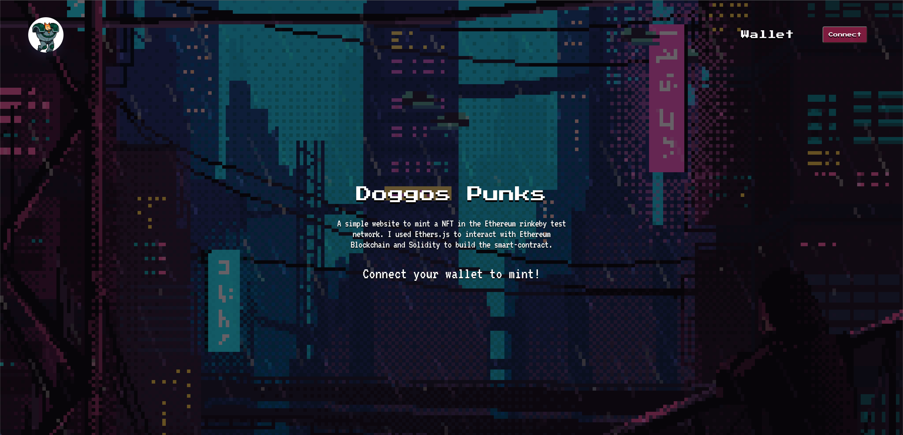
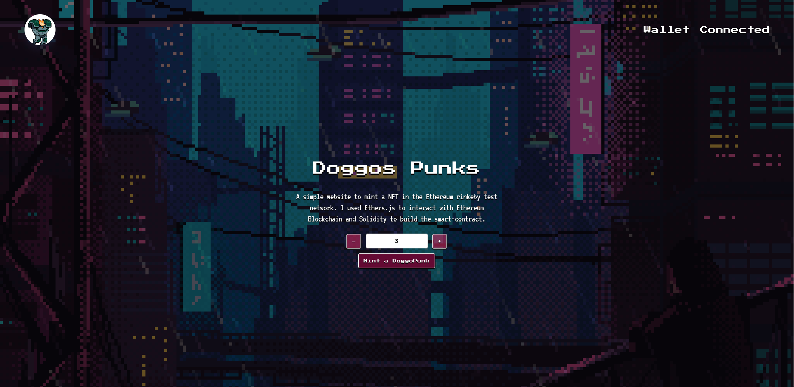

<h1 align="center">DoggosPunk</h1>

  <a href="#about">About</a> •
  <a href="#general-information">General Information</a>• 
  <a href="#technologies">Technologies</a> •
  <a href="#screenshots">Screenshots</a> 

# DoggosPunk Nft Minting

_Important note: Make sure to have Metamask installed and Rinkeby as network for testing porpuses. Do NOT USE YOUR MAIN METAMASK ACCOUNT, any eth that you use for testing the app will be lost. USE RINKEBY TEST NETWORT. You can use any rinkeby faucet to get eth_

> Live demo [_here_](https://funny-khapse-2b44ce.netlify.app/).

## About

-   A simple website to mint a NFT in the Ethereum rinkeby test network. I used Ethers.js to interact with Ethereum Blockchain and Solidity to build the smart-contract.

## Technologies

-   React.js
-   Ethers.js
-   Openzeppelin
-   Hardhat
-   Soidity

## General-Information

-   Contract Address (ETH): 0x5b18a14318fb834c619059a7743f2c64fc80b0f5
-   Verified Contract: [_Etherscan_](https://rinkeby.etherscan.io/address/0x5b18a14318fb834c619059a7743f2c64fc80b0f5#code)

## Screenshots

